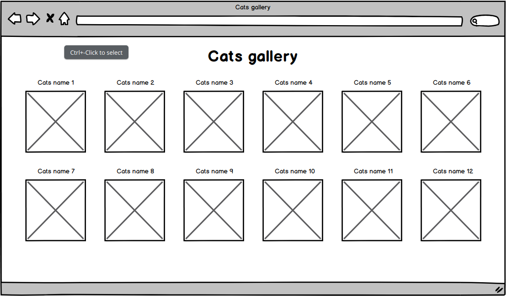
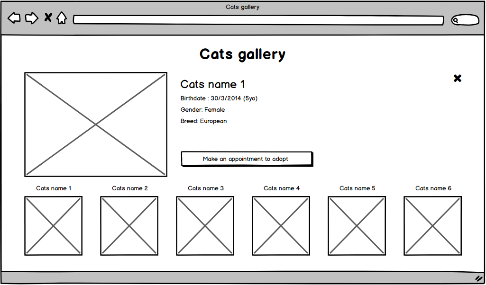
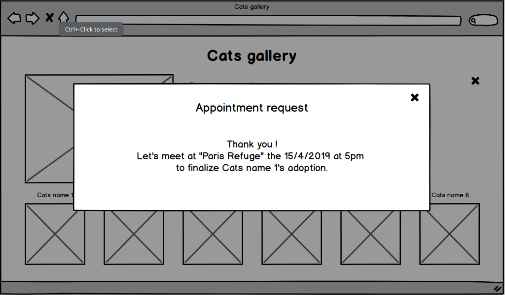

# Spécifications <a href="./SPECIFICATIONS.en.md">English Version</a>

## Introduction

Nous vous proposons ce petit exercice dans le but de découvrir comment vous abordez un problème donné. Il n'existe pas de réponse exacte ou de manière unique de traiter le problème proposé. Le but de ce test est de cartographier vos forces et faiblesses. Nous pourrons par la suite se servir de votre code comme support de discussion lors de votre entretien technique.

## Scénario

Un client aimerait créer une **interface web "desktop"** d'une association féline. Cette interface doit montrer des chats qui ont besoin d'être adoptés et doit laisser la possibilité au visiteur de planifier un rendez-vous pour une future adoption.

## Livrables

- Une galerie d'images de chats avec leur nom associé.



- Au clic sur un chat nous pouvons accéder à ses informations ainsi qu'à un bouton permettant de "Planifier un rendez-vous"



- Au clic sur "Planifier un rendez-vous", l'utilisateur doit pouvoir voir la date et l'horaire de son rendez-vous.



**Les images proposées sont données comme exemple. Vous pouvez adapter l'agencement des pages selon vos envies.**

## Exigences

Vous devez créer des composants pour structurer votre interface. Pour afficher les chats et générer la date de rendez-vous, vous allez devoir consommer deux endpoints d'API :

### Endpoint de listing de chats

- **URL** : `https://europe-west1-matters-test.cloudfunctions.net/getCats`

- **Method** : `GET`

- **Auth required** : No

- **Success response** :

  - **Code** : 200
  - **Content** : `[{"id":"1","name":"Robi","birthdate":"2015-03-29","breed":"Persian","location":"Paris refuge - 75","gender":"Male","picturePath":"http://placekitten.com/200/300"}, ...]`

- **Error response** :
  - **Code** : 405
  - **Content** : `{"error":"Method not allowed"}`

### Endpoint de rendez-vous

- **URL** : `https://europe-west1-matters-test.cloudfunctions.net/getAdoptionAppointment`

- **Method** : `POST`

- **Auth required** : No

- **Request body** :

```
{
  "catId": 15
}
```

- **Success response** :

  - **Code** : 200
  - **Content** : `{"appointment":"2019-04-09T20:04:42.230Z"}`

- **Error responses** :

  - **Code** : 405
  - **Content** : `{"error":"Method not allowed"}`

  - **Code** : 400
  - **Content** : `{"error":"You must provide a valid catId (number)"}`

## Pour aller plus loin

Si vous voulez creuser et améliorer votre projet, voici quelques pistes d'améliorations possibles :

- Faire en sorte que l'interface soit responsive sur les différents types d'écran
- Rajouter des tests d'intégration (ou autre)
- ...

## Soumettre votre travail

Quand vous pensez avoir fini l'exercice, veuillez pousser votre code sur une feature-branch et ouvrir une pull request ;)
